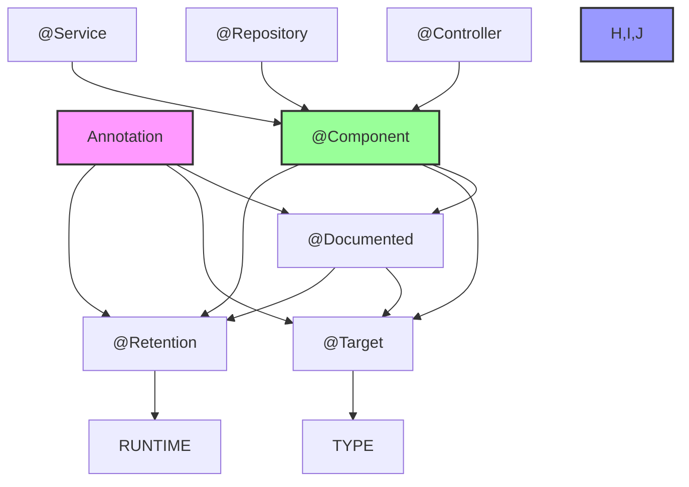
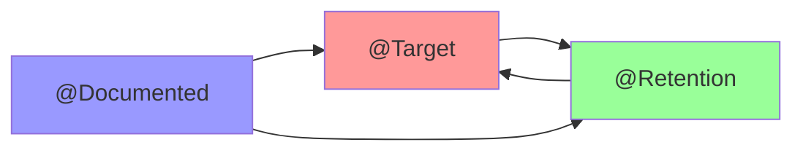
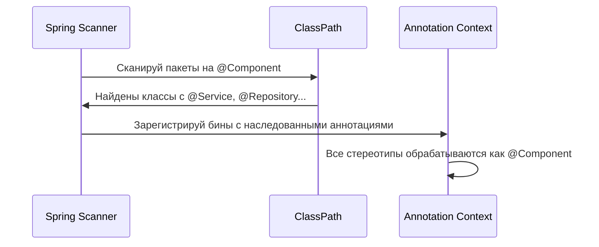

# 📊 Визуализация иерархии аннотаций

## Дерево наследования Spring аннотаций



Рекурсивные мета-аннотации



Spring сканирование аннотаций



## Запуск проекта:

```bash
# Клонируй и запускай
git clone https://github.com/yusdesign/java-spring-deep-dive.git
cd java-spring-deep-dive
./gradlew bootRun
```

О природе JAVA Spring аннотаций… 🎯
